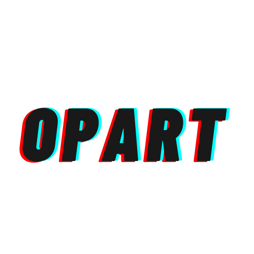

<p align="center">
  
</p>

# The Optimal Art Curation Tool

This library contains the tool of OpArt: The Optimal Art Curation Tool. Further details about the algorithms in this repository can be found in *A Recommender System for Equitable Public Art Curation and Installation*.

## Getting Started with OpArt

### Setting Up your Environment

Before you get started, you'll need to create a new environment using e.g. `conda`.  If you used `conda` you can create a new environment (we'll call it `opart_env`) with 
```
conda create --name opart_env
```
and activate your new environment, with
```
conda activate opart_env
``` 
Now you will need to install the necessary dependencies.  First you'll need to conda install `pip` and then install the remaining required Python libraries as follows.
```
conda install pip
pip install -U -r requirements.txt
```
Now your environment should be set up to run anything in the OpArt library.

### Using OpArt

Each assignment in OpArt requires a number of parameters as arguments: 
```
        beta: (float) beta factor determines weight of the diversity 
            objectives in the optimization (i.e. "term 1").
        lam: (float) lambda factor determines weight of artwork capacity 
            constraints in optimization (i.e. "term 2").
        tau: (float) tau factor determines weight of preference for current 
            assignment in optimization (i.e. "term 3").
        init: (int) one of the following: 
                1 - identity matrix initialization
                2 - uniform initialization
                3 - current assignment initialization
                4 - random permutation initialization
        iterations: (int) number of iterations of gradient descent
```
The fastests way to create an assignment with OpArt is to run it from the command line as a Python script from the top-level repository folder:

```
python src/learning.py <beta> <lam> <tau> <init> <iterations>
```
where the values in angled brackets are replaced with the desired parameters, for example
```
python src/learning.py 1 100 1 1 1000
```
runs the optimization with beta = 1, lambda = 100, tau = 1, init = 1 and iterations = 1000.  This will print all necessary data into the `output` folder.

To help you on your way, several notebooks have been provided in `notebooks` that contains demo workflows for the OpArt library.  

* `workflow_demo.ipynb` demonstrates the basic work flow from running and validating an optimization.
* `recreate_results_from_paper.ipynb` recreates the results in *A Recommender System for Equitable Public Art Curation and Installation*.


